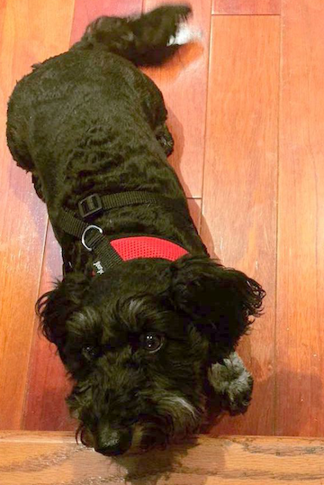

# **My Lab Journal**

I will be using this website to learn R throughout the course of the semester. All of the projects I complete will be uploaded to this website.

## Content

1. The first tab is for my journal, which is where I will be putting all of the different problems I go through.

2. Next, you will see different links that are helpful for learning R.

### [Casey Williamson: R class Journal](https://willi4cm.github.io)

